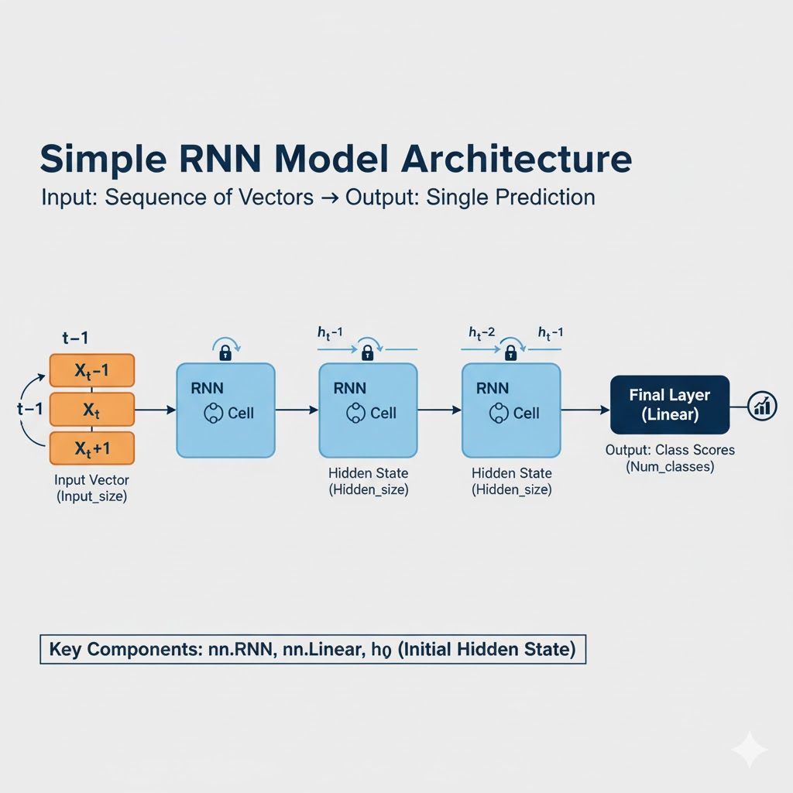

# 🧠 Basic PyTorch Workflow

## 🧠 Overview

A self-contained Python script (`workflow.py`) that serves as a complete reference for modern PyTorch development. It demonstrates foundational concepts and production-ready techniques for building robust deep learning models.

This repository enables developers to:

- Understand and manipulate PyTorch Tensors and Autograd.
- Build Feed-Forward, CNN, and RNN architectures.
- Train models with custom datasets and loaders.
- Apply transfer learning and deploy models with TorchScript.
- Optimize performance using AMP and gradient clipping.

---

## 📛 Badges


---

🧠 Key Features

- **Tensor Operations**: Initialization and manipulation of PyTorch tensors.
- **Autograd**: Automatic differentiation and gradient computation.
- **Model Architectures**: Feed-Forward, CNN, RNN implementations.
- **Data Pipeline**: Custom `Dataset` and `DataLoader`.
- **Training Utilities**: Loss functions, optimizers, schedulers.
- **Stability Enhancements**: Gradient clipping and error handling.
- **Transfer Learning**: ResNet-18 with frozen weights and custom head.
- **Model Persistence**: Save/load model weights using `state_dict`.
- **Deployment**: TorchScript conversion for production use.
- **Performance Optimization**: AMP via `torch.cuda.amp.GradScaler`.

---

## 🧠 Architecture & Training Workflow Diagram





---

## ⚙️ Setup Instructions

### 1. Clone and Install

```bash
git clone https://github.com/luckyjoy/basic_pytorch_workflow.git
cd basic_pytorch_workflow
pip install -r requirements.txt
```

### 2. Running:
python workflow.py

---


## 🧩 Contributing

1. Fork the repository
2. Create a new branch (`feature/awesome-enhancement`)
3. Commit your changes
4. Open a Pull Request

---

## 🧑‍💻 Maintainers

* **Author:** Bang Thien Nguyen - ontario1998@gmail.com


---

## 📜 License

This project is licensed under the MIT License. See [LICENSE](LICENSE) for details.
